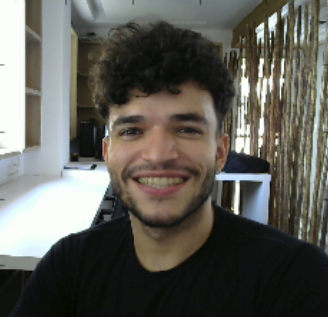
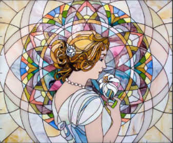
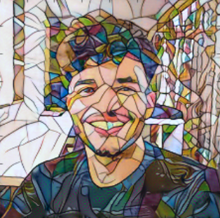
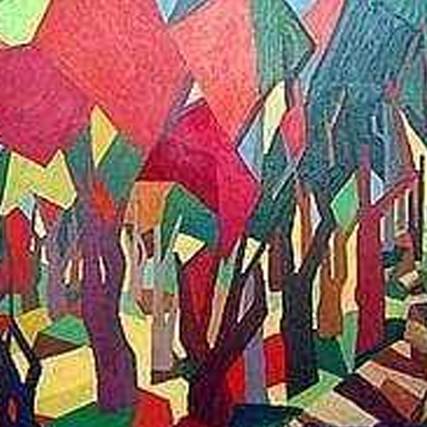

<a href="https://singularitynet.io/">

</a>

# Artistic Style Transfer

> Repository for the style transfer service on the SingularityNET.

[](https://github.com/singnet/style-transfer-service/issues/) 
[](https://github.com/singnet/style-transfer-service/pulls) 
[](https://github.com/Naereen/StrapDown.js/blob/master/LICENSE)

This service uses convolutional neural networks to transfer the style of an image to another. Specifically, we're using a VGG model pre-trained on the ImageNet data (available at [https://cntk.ai/jup/models/vgg16_weights.bin](https://cntk.ai/jup/models/vgg16_weights.bin) ) to transfer the style of a _style image_ to a _content image_. 

The code in this repository is an adaptation of the Artistic Style Transfer code available at Microsoft's CNTK repository as a [tutorial](https://github.com/Microsoft/CNTK/blob/master/Tutorials/CNTK_205_Artistic_Style_Transfer.ipynb), integrated as a service on the SingularityNET.

## Usage

To use this service please set snet's session variable _current_\__agent_\__at_ to the address of this agent on the SingularityNET (check the specific address at [http://alpha.singularitynet.io/](http://alpha.singularitynet.io/)) by running:

```
snet set current_agent_at ADDRESS
```

You will then be able to call the service by running:

```
snet client call transfer_style 'INPUT_DATA'
```

In which __INPUT_DATA__ is a JSON containing the input information. 

### Required Parameters

- content_path \[string\]: the path of the content image;
- style_path \[string\]: the path of the style image;

These paths can be either a reference to a local image (see [Example Images](#example-images)) or a link to a file hosted on the web. Only _.jpg_ and _.png_ images are currently accepted.

#### Basic Example Call

```
snet client call transfer_style '{"content_path":"images/mona_lisa.jpg", "style_path":"images/the_starry_night.jpg"}'
```

### Optional Parameters

- start_from_random (False): tells the algorithm to start from the content or from a randomly generated image;
- optimization_rounds (10): number of optimization rounds;
- optimization_iterations (20): number of optimization iterations per round;
- output_image_size (300): images passed as inputs will be converted to square images of this size. The larger the size, the longer the style transfering will take due to an increased number of operations.

#### Advanced Example Call

```
snet client call transfer_style 
'{"content_path":"images/mona_lisa.jpg", 
"style_path":"images/the_starry_night.jpg",
"start_from_random":True,
"optimization_rounds":3,
"optimization_iterations":5,
"output_image_size":400}'
```

### Return

The service returns:

- size \[int\]: the size of the output image (can be set as an input parameter);
- data \[string\]: the base64 encoded image in a _numpy.ndarray_ format.

Allow the service to run for a few minutes to generate the output image (~ 2 min for the default image size).

## Example Output

This is an example of an output generated by this service using the default parameters (content image on the top left, style image on the top right, result on the bottom):

<p align="center">
            | 
</p>

<p align="center">
  
</p>

## Locally Available Images

The following images are available locally at the _images/_ directory to be used for tests as either content or style:

the_starry_night.jpg               | modernism.jpg
:---------------------------------:|:-------------------------:
 | 

mona_lisa.jpg                      | abstract.jpg
:---------------------------------:|:-------------------------:
        | 

## Running

To run a copy of this code, please fork the repository, open a terminal, navigate to the root of the forked repository and run:

```python3
python3.5 run_style_transfer.py --daemon-config config/
```

Make sure to change the JSON configuration file [config/snetd_style_transfer_service.json](./config/snetd_style_transfer_service.json) to match the communication ports for your system. The same ports are also referenced in the [service/__init__.py](./service/__init__.py) file.

Also, make sure that your system meets the [requirements](./service/requirements.txt).

## License

This code is available under the MIT License (see the [LICENSE](LICENSE) file for details).

____________

## TODO:

- Create user interface (and allow image upload)
- Upload the output image as the algorithm optimizes it (and allow user to stop the process)
- Can the model change the picture's lines?? ( Picasso / Tarsila do Amaral / Play with content vs style optimization parameter)
- Return .jpg encoded data file instead of ndarray 
- Allow other image formats (?)
- Download example images and make them available
- Delete temporary images automatically
- Add example inputs (images + parameters)/outputs to the README

- Error handling for the model
- Error handling for loading the images
- Error handling for the URLs themselves

### Known Issues:

- Crops central part of rectangular images to use as input

### Done:

- Allow .png images
- Stop saving snapshots (but keep the code nearby to show the changes when UI allows)
- Specify number of epochs : done by specifying (specially) optimization_rounds but also optimization_iterations
- Allow images from URL
- Download temporary images
- Check the behaviour of the model for images smaller than SIZE : they're simply resized 